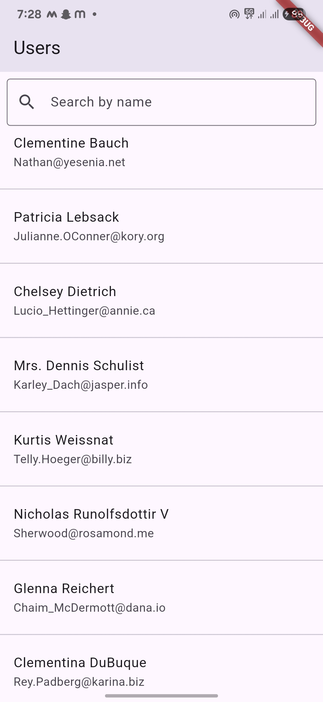
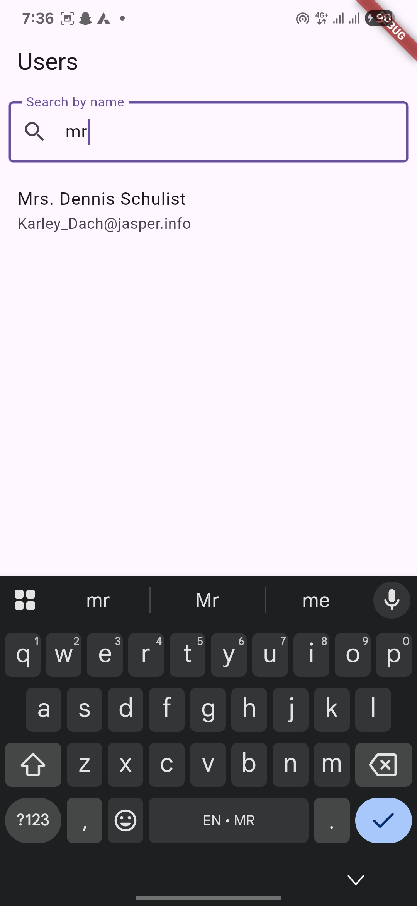

# user_app

A Flutter application that fetches and displays a list of users from a public API. The app supports searching, pull-to-refresh, and viewing user details.

## Features

- Fetches user data from https://jsonplaceholder.typicode.com/users
- Shows loading spinner during data fetch
- Handles API errors gracefully with retry option
- Search users by name with real-time filtering
- Pull to refresh the user list
- View detailed user information on tap

## Getting Started

### Prerequisites

- Flutter SDK installed
- Android Studio or VS Code setup for Flutter development
- An Android device or emulator for testing

### Running the App

1. Clone the repository or download the source code.
2. Open a terminal in the project root.
3. Run `flutter pub get` to install dependencies.
4. Connect an Android device or start an emulator.
5. Run `flutter run` to build and launch the app.

### Building APK

For generating a release APK you can run:
flutter build apk --release

The APK will be available at `build/app/outputs/flutter-apk/app-release.apk`.

## Project Structure

- `lib/` contains Dart source files:
    - `main.dart` - App entry point and UI
    - `user.dart` - User data model
    - `api_service.dart` - API interaction service
    - `user_provider.dart` - State management with Provider

## Additional Notes

- Make sure to grant internet permission in AndroidManifest.xml.

## Screenshots

